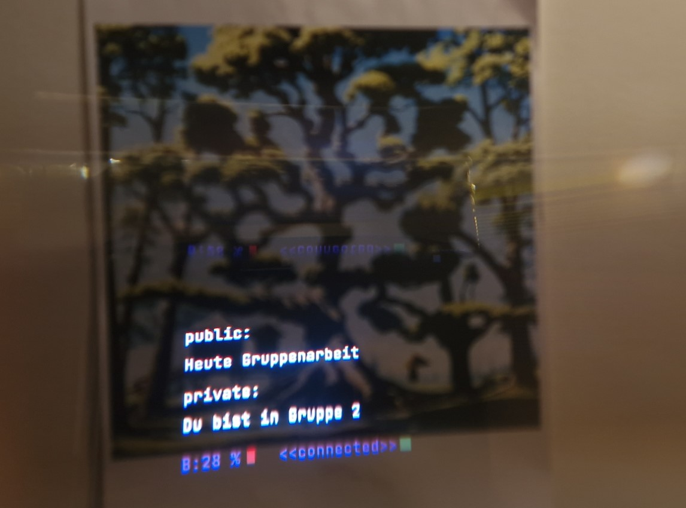

# ARID: Augmented Reality in Disguise

**ARID** is a unique project that explores the possibility of embedding secret messages in everyday images using QR codes and augmented reality (AR). The goal is to transform regular images into carriers of hidden, encrypted communication, leveraging the human tendency to overlook common visual elements in daily life. These QR codes, undetectable by the naked eye, contain encrypted messages that can only be deciphered by a specialized device—**the Monocle from Brilliant Labs**.

**Showcasing** There is a script for Running the Project Without the Monocle



Here’s an example:


## Project Goals

- **Hidden Messages in Images**: Secret messages are embedded in randomly generated images. These images follow a specific theme but hide QR codes that are invisible to the average viewer.
- **QR Code Recognition**: The **Brilliant Labs Monocle** is used to scan these images and detect the hidden QR codes.
- **Encryption**: The QR codes contain encrypted messages, ensuring that even if the code is detected, the message remains secure.
- **Decryption on Monocle**: Only the Monocle can automatically decrypt these messages and display the content on its screen.

## Features

- **Image Embedding**: A machine learning-based image generator creates themed images where QR codes with hidden messages are embedded.
- **QR Code Detection**: The Monocle device scans the image and decodes the hidden QR code.
- **Encrypted Communication**: QR codes contain encrypted data, adding an extra layer of security to the hidden messages.
- **Message Display**: After decoding and decryption, the Monocle displays the message to the user in a secure way, ensuring that only authorized devices can read the secret content.

## How It Works

1. **Scanning with the Monocle**: The user scans the image using the Brilliant Labs Monocle.
2. **QR Code Detection and Decryption**: The Monocle recognizes the hidden QR code in the image, decrypts the message, and displays it on the device.
3. **User Interaction**: If the Monocle doesn’t detect a hidden message, it will ask the user if they want to create and embed a new encrypted message.

## Technology Stack

- **Python**: Core language for image processing and QR code embedding.
- **OpenCV**: For image manipulation and applying thresholding techniques to improve QR code detection.
- **PIL (Python Imaging Library)**: For handling and processing images.
- **qreader**: A library to detect and decode QR codes.
- **Flask**: For backend communication to store and retrieve hidden messages.
- **Brilliant Labs Monocle**: AR glasses used for detecting and decrypting hidden messages in the QR codes.

## Installation

### Requirements
- Python 3.x
- OpenCV
- Pillow
- qreader
- Flask

Install the dependencies using:

```bash
pip install opencv-python Pillow qreader Flask
```

## Usage

1. **Before:** Ensure the database connection is configured in Agumented-Reality-in-Disguise-ARID-/server/app.py.
2. **QR-Codes:** Download the QR codes you want to scan from the Agumented-Reality-in-Disguise-ARID-/client-with-monocle/qr_samples folder.


### Embedding and Scanning Hidden Messages
 
1.
 ```bash
git clone https://github.com/Aamir-Basha/Agumented-Reality-in-Disguise-ARID-.git
```
2. ```bash
cd server
falsk run
   ```
3. **In a new Terminal** run the main script 
```bash 
cd client-without-monocle
python main.py
```     

Modes of Operation
1. Client-Side Without Monocle
This version is ideal for testing or showcasing the project without needing the Monocle. By using thresholding techniques and OpenCV, it enhances QR code detection under different lighting conditions and allows for hidden message processing directly on a local machine. The clientside-without-monocle directory contains the scripts to run this version.

2. Client-Side With Monocle
For full functionality using the Brilliant Labs Monocle, the client-with-monocle folder enables real-world application where QR codes are detected and decrypted using the AR device. This mode demonstrates the project’s intended use case for hidden communication through AR glasses.


## Future Enhancements

- **Advanced Machine Learning**: Using more sophisticated AI models for better image generation and QR code embedding.
- **Real-Time Processing**: Optimizing the Monocle’s ability to detect and process hidden messages in real time.
- **Improved Encryption**: Enhancing cryptographic methods for more secure communication.

